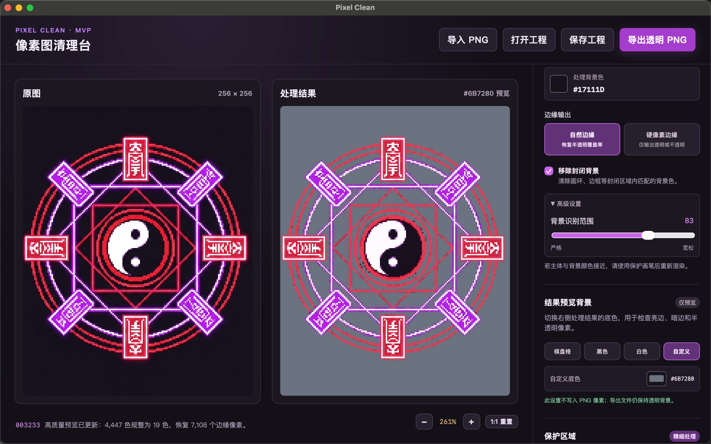
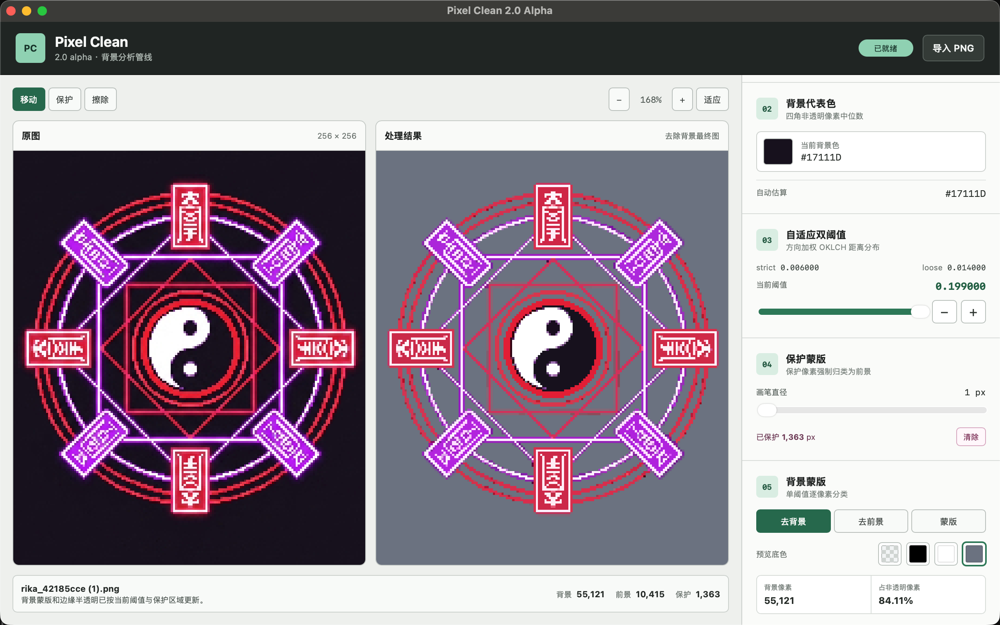
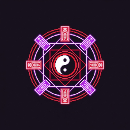
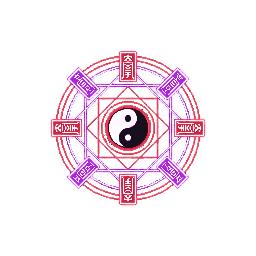
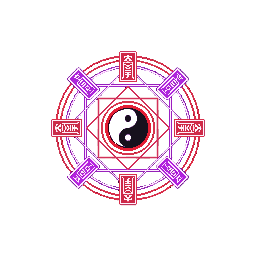

# Pixel Clean 2.0

Pixel Clean 是一款使用 Tauri、React 和 TypeScript 开发的本地像素图处理工具。2.0 采用模块化流水线重建：每个处理模块拥有明确的输入和输出，上一步结果可以直接交给下一步，并根据依赖关系只重算受影响的阶段。

当前版本为 `2.0.0-alpha.1`。1.0 已通过 Git tag `1.0` 封存。

## 1.0 与 2.0 效果对比

### 工作区

| Pixel Clean 1.0 | Pixel Clean 2.0 Alpha |
| --- | --- |
|  |  |

### 同一原图的导出结果

| 原始输入 | Pixel Clean 1.0 | Pixel Clean 2.0 Alpha |
| --- | --- | --- |
|  |  |  |

1.0 使用旧版全局颜色规整与背景移除流程，能够生成透明 PNG，但复杂暗部、内部背景和辉光边缘仍可能留下不连续的色块。2.0 将局部颜色岛、方向加权 OKLCH 背景分类、保护蒙版和线性 RGB Alpha 反算串成模块化管线；在同一张像素图上，颜色区域更连贯干净，内部及外部背景去除更彻底，接近背景的主体细节也能通过保护蒙版明确保留。

这组 `256 × 256` 样例中，原图的 `65,536` 个像素全部不透明。1.0 导出结果包含 `52,109` 个全透明像素、`7,108` 个半透明像素和 `6,319` 个不透明像素；2.0 Alpha 导出结果包含 `55,121` 个全透明像素、`1,013` 个半透明像素和 `9,402` 个不透明像素。2.0 在清除更多背景像素的同时，将更多主体线条保留为明确的不透明像素，仅在需要恢复柔和边缘的位置保留连续 Alpha。

两张导出图本身都不含黑色背景；透明区域的显示颜色取决于 Markdown 阅读器或图片查看器。

## 当前产品范围

2.0 第一阶段已经形成可运行的桌面软件窗口，并交付以下生产模块：

1. 四邻域动态平均色岛屿归并；
2. 四角背景色估算；
3. 基于全图方向加权 OKLCH 距离分布的自适应双阈值；
4. 用户可调单阈值背景蒙版；
5. 可绘制、擦除和清空的保护蒙版；
6. 边缘辉光岛识别、线性 RGB Alpha 反算和背景色去污染；
7. 去背景最终图、去前景和二值蒙版同步预览，并支持透明棋盘、黑色、白色及自定义预览底色；
8. 同步缩放、拖拽和点击像素检查。
9. 将最终边缘半透明结果导出为带真实 Alpha 的透明 PNG。

同一张 PNG 的编辑设置会自动记忆。软件使用文件内容的 SHA-256 作为图片资源键，将项目记忆保存到本地 IndexedDB；重新导入同一文件时，会恢复近似颜色阈值、保护蒙版、背景阈值、边缘方向距离差值、画笔直径、预览模式、预览底色、工具模式、缩放/平移位置和选中像素。文件改名或移动不会影响恢复，修改了文件内容则会生成新的记忆项目。上游算法版本升级时保留保护蒙版和界面设置，但受影响的背景阈值会失效并重新计算。

保护蒙版满足以下强约束：

```text
protectedMask[pixel] = 1
=> backgroundMask[pixel] = 0
```

保护像素始终被分类为前景。阈值或保护蒙版变化时，软件复用已经计算的像素距离，不重新执行背景色估算和自适应阈值分析。

## 当前处理流程

```text
PNG 解码
→ 以动态平均 OKLab 双约束生成四邻域颜色岛屿
→ 计算岛屿 OKLab 中位中心并替换为最近的岛内真实颜色
→ 四角背景色自动估算
→ 计算 ΔL / ΔC / ΔH
→ 按 0.5 / 2 / 2 生成方向加权距离
→ 自适应 strict / loose
→ 当前单阈值选择
→ 保护蒙版约束
→ 二值背景蒙版
→ 查找与背景四邻接且方向距离余量在 (0, 用户差值] 的前景种子
→ 将种子所在的未保护颜色岛整体标记为辉光岛
→ 使用邻近实体前景锚点在线性 RGB 中反算 Alpha 和前景色
→ 清空背景像素并输出半透明最终图
→ 编码并导出透明 PNG
```

边缘候选使用 `方向距离 - 当前阈值` 判断，但距离只负责选择候选。实际半透明恢复采用线性 RGB 混合模型：

```text
observed = alpha * foreground + (1 - alpha) * background
alpha = dot(observed - background, foreground - background)
      / dot(foreground - background, foreground - background)
```

方向距离差值默认 `0.100`，可在 `0.000..0.300` 范围内按 `0.001` 调整；`0` 表示不选择辉光岛。锚点拟合必须通过绝对残差和相对残差校验。找不到可靠实体前景锚点时保持原像素不变并计入“未解决”；原有半透明像素保持不变；保护像素既不会触发辉光岛，也不会被最终结果修改。“去背景”预览直接显示清空背景并完成边缘半透明恢复后的最终图，不再提供独立的归并图或半透明预览模式。透明棋盘、黑色、白色和自定义预览底色只作用于右侧画布，不进入算法结果。

## 模块结构

```text
src/
├── algorithms/   纯图像算法
├── pipeline/     模块编排、结果契约和 Worker 协议
├── editor/       保护蒙版编辑逻辑
├── components/   图像视图和参数控件
├── backgroundAnalysis.worker.ts
└── App.tsx
```

算法模块不读取 React 状态。应用通过常驻 Worker 执行完整背景分析，并在阈值或保护蒙版变化时复用归并图、颜色岛编号和距离场，只重新执行背景分类与边缘半透明重建。

## 后续模块

2.0 的最终目标仍然是完整背景移除和局部近似颜色归并。当前已经接入基础背景清除和边缘半透明恢复，后续模块将按相同契约逐步完善：

```text
现有半透明最终图
→ 蒙版连通区域与误分类修整
→ 更复杂纹理的前景锚点估算
→ 透明像素规范化与结果质量检查
→ 批量处理与更多导出质量检查
```

## 开发

安装依赖：

```sh
npm install
```

启动桌面开发环境：

```sh
npm run tauri:dev
```

只启动前端：

```sh
npm run dev
```

运行测试和生产构建：

```sh
npm test
npm run build
```

## 算法检查工具

交互式报告继续用于验证算法，但不属于产品运行界面：

```sh
npm run test:background-color -- --local-threshold 0.02
npm run test:adaptive-thresholds -- --background "#1C1523" --local-threshold 0.02
npm run test:background-mask -- --background "#1C1523" --local-threshold 0.02 --strict 0.015 --loose 0.019
```

报告读取 `tests/input/images/` 中的 PNG，生成结果写入已忽略的 `test-results/`。

## 构建发布

```sh
npm run tauri:build
```

Windows 和 macOS 安装包必须在对应系统上构建。macOS 对外分发仍需要 Apple Developer 签名和公证。
